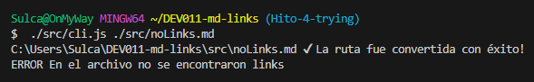

#MD-Links

## Descripción

Este proyecto es una interfaz de línea de comandos (CLI) que te permite revisar archivos Markdown en busca de enlaces y realizar acciones como verificar su estado y obtener estadísticas. A continuación, encontrarás información detallada sobre la estructura del proyecto!



## Archivo index.js

Dentro de `index.js` se encuentra la lógica principal del módulo `mdLinks`. Aquí se define la función principal que analiza archivos Markdown y devuelve los enlaces, junto con opciones adicionales de validación y estadísticas.

## Archivo cli.js

El archivo `cli.js` actúa como el punto de entrada de la aplicación CLI. Este script acepta argumentos de línea de comandos para indicar la ruta del archivo Markdown y opciones adicionales, como `--validate` para validar enlaces y `--stats` para obtener datos estadísticos.

## Archivo function.js

El archivo `function.js` alberga funciones auxiliares utilizadas por `mdLinks` para llevar a cabo diversas tareas, como verificar la existencia de una ruta, convertir rutas a absolutas, leer el contenido de un archivo, encontrar enlaces en el contenido y validar enlaces.

##  Guía (comandos de uso) 

* Para leer un archivo markdown y extraer sus enlaces 
```bash
./src/cli.js ./src/test.md 
```

* Para verificar el estado de cada uno de los links extraídos podemos ingresar en nuestra terminal (Git Bash) 
```bash
./src/cli.js ./src/test.md --validate
```

Este comando muestra el estado de los enlaces encontrados en el archivo Markdown en la ruta especificada al ingresar en nuestra terminal (Git Bash) 

* Para obtener un estadistica del archivo analizado ingresaremos en nuestra terminal (Git Bash) 

```bash
./src/cli.js ./src/test.md --stats
```

# Instalación desde GitHub

Puedes instalarlo directamente desde GitHub con el siguiente comando en Git Bash

```bash
  npm install allisonsulca21/md-links
```
